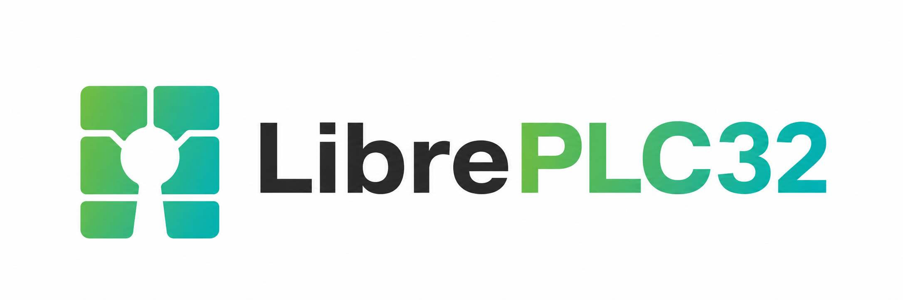
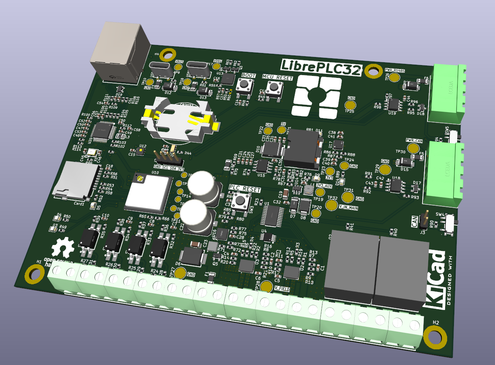

<p align="center">
  
</p>

# LibrePLC32

**LibrePLC32** is an open-source, KiCad-based Programmable Logic Controller (PLC) hardware project.

The goal of the project is to create a compact, hackable, and well-documented PLC platform for industrial automation experiments, prototyping, education, and open hardware development.

> ⚠️ **Work in progress:** LibrePLC32 is currently under development.

<p align="center">
  
</p>

## Project goals

LibrePLC32 aims to provide:

- An open hardware PLC design
- KiCad source files for schematic and PCB development
- Field-oriented interfaces such as digital I/O, isolated CAN, isolated RS-485, and Ethernet
- A design that can be studied, modified, repaired, and improved by the community
- Documentation for design decisions and component calculations

## Repository structure

```text
.
├── img/              # Project logo and graphics
├── plc/
│   ├── docs/         # Design notes and calculations
│   └── kicad/        # KiCad project, schematics, PCB, and libraries
├── LICENSE
└── README.md
```

## Features

LibrePLC32 is designed to provide a practical set of PLC-oriented hardware features:

- **8–36 V DC input voltage range**
- **4 isolated digital inputs** for field signals
- **4 transistor digital outputs** for driving external loads
- **2 relay output terminals** for switching isolated loads
- **Isolated RS-485 interface** for industrial serial communication
- **Isolated CAN bus interface** for device-to-device communication
- **Ethernet interface** for network connectivity